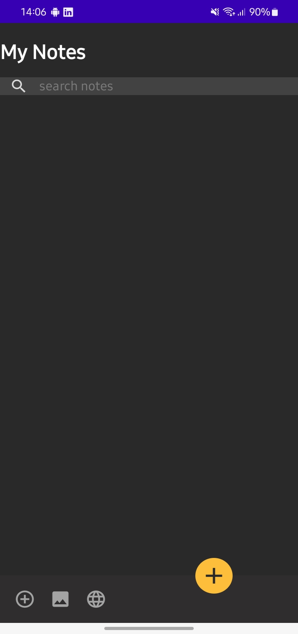
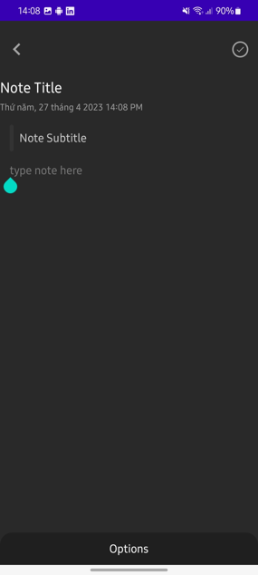
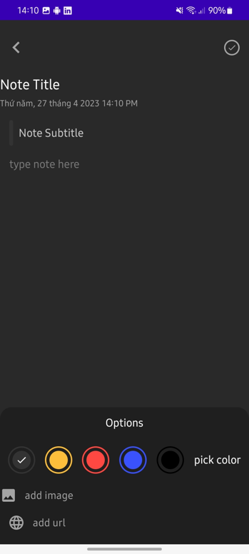
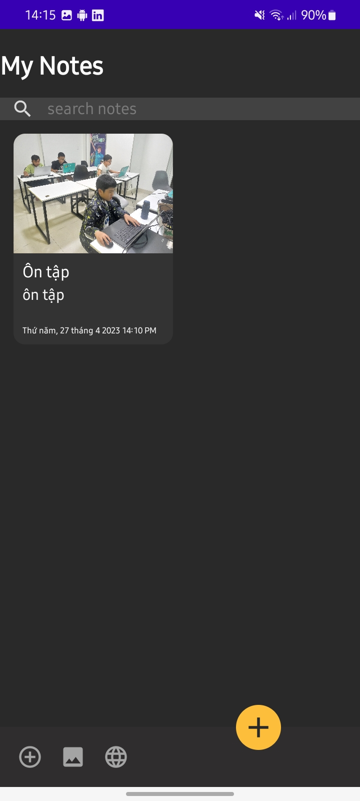

# Note_App

## ⭐ Description:

Note App is an app made with **Android**.
The note-taking function allows users to create, edit, and delete notes. Users can also insert images and links into their notes.
Additionally, the function includes a search feature that enables users to find specific information within their notes.

## ⭐ Experiments

|            Welcome Home Screen       |           Create Node Screen       |
| :----------------------------------: | :--------------------------------: |
|                  |          |
|                    |                  |

## ⭐ Future Features

-   Pending

_Feel free to fork and contribute to include these features._ ❤︎

## 🚀 Technologies

 Programming tools and languages used:
  -   Programming tools: Android Studio.
  -   Programming language: Java.
    
## 🤝 Contribute

To contribute, fork the repository and push the changes to the **master** branch. Then submit a pull request for merging with the source. If your code passes the review and checks it will be merged into the master branch.

## 💬 Feedback

Feel free to send us feedback on [Gmail] Feature requests are always welcome.

## 📝 License

Licensed under the [MIT License].
